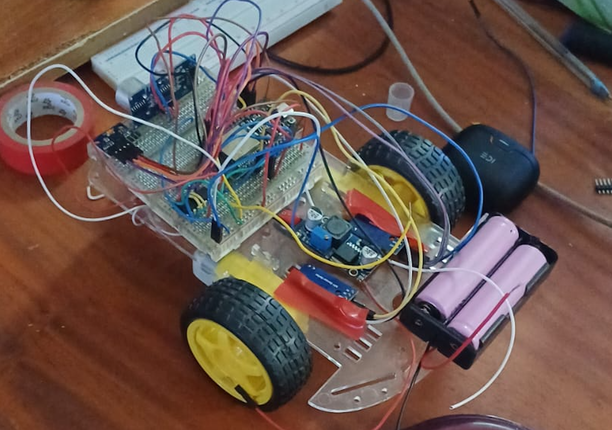
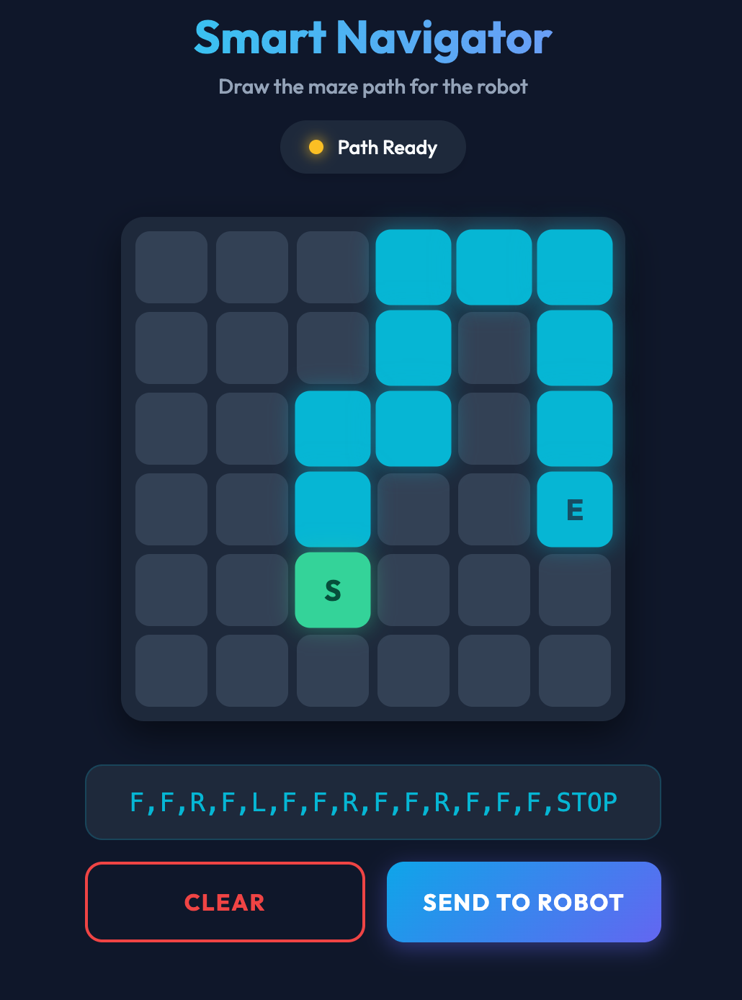

<h1 align="center">XtracBOT</h1>

  <strong>An intelligent, Wi-Fi controlled Smart Line Following & Maze Solving Robot built with ESP32.</strong>

  
  

## ✨ Features
* **📱 Wireless Web Control:** Connect to the robot's Wi-Fi network and control it from your phone's browser.
* **🗺️ Grid Path Planning:** Send complex command queues (e.g. `F,R,F,L,F,STOP`) to navigate mazes.
* **🎯 Closed-Loop PID Control:** Uses LM393 optical encoders on the wheels to guarantee the car drives perfectly straight.
* **🧭 Precision Turns:** Calculates exact 90° and 180° pivot turns using encoder ticks, with independent left/right calibration variables.
* **🛑 Obstacle Avoidance:** Front-facing HC-SR04 Sonar detects objects within 15cm and pauses the robot safely.
* **🚨 Visual Feedback:** Dedicated warning LED illuminates when obstacles block the path.
* **⚖️ I2C Gyroscope:** Integrated MPU-6050 (GY-521) for future rotational math, featuring a robust startup sequence that prevents I2C bus lockup from encoder interrupts.

---

## 🧠 How It Works

XtracBOT merges embedded hardware with a modern web frontend to create a wireless smart-robot architecture. Here is the step-by-step logic loop:

1. **The Server Layer:** The ESP32 acts as an Access Point (AP) and runs a lightweight web server. When a user connects to `http://192.168.4.1`, the ESP32 serves the `webapp/index.html` interface directly from its PROGMEM memory.
2. **Path Building:** The user taps the interactive grid on their phone to build a path. The phone's JavaScript translates this visual path into a comma-separated command string (e.g., `F,F,R,F,L,STOP`).
3. **Transmission:** Tapping "Send to Robot" fires an asynchronous HTTP GET request to the ESP32 (e.g., `http://192.168.4.1/path?cmd=F,F,R,F,L,STOP`).
4. **Execution Queue:** The ESP32 parses the string command-by-command. 
   - For `F` (Forward), it drives exactly 20cm using a **Closed-Loop PID algorithm**. It reads ticks from the left and right LM393 optical encoders. If the left wheel spins faster, it digitally throttles the left motor down via PWM to keep the robot driving perfectly straight.
   - For `L` (Left) or `R` (Right), it halts forward momentum and spins the wheels in opposite directions until the exact number of calibrated encoder ticks (representing 90 degrees) have passed.
5. **Safety Override:** During every forward movement, the HC-SR04 Sonar pings the environment. If it detects an obstacle closer than 15cm, the ESP32 instantly cuts power to the motors and illuminates the warning LED. It continuously polls the sonar and resumes the path only once the obstacle is cleared.

---

## 🛠️ Hardware Stack
* **Microcontroller:** ESP32 (30-Pin)
* **Motor Driver:** L293D
* **Motors:** 2x standard TT DC Gear Motors
* **Encoders:** 2x LM393 Optical Speed Sensors
* **Gyroscope:** MPU-6050 (GY-521 Clone)
* **Sonar:** HC-SR04 Ultrasonic Sensor
* **Power Supply:** 7.4V (2x 18650 Li-ion) + LM2596 Buck Converter (stepped down to 5.0V for ESP32)

---

## 🚀 Installation & Setup

1. **Upload Firmware:** Flash `SmartLFR_Firmware.ino` to your ESP32 using the Arduino IDE. 
   *(Requires the `ESPAsyncWebServer` and `AsyncTCP` libraries)*
2. **Power Up:** Turn on the battery pack. The ESP32 will boot and broadcast a Wi-Fi network.
3. **Connect:** Open your phone's Wi-Fi settings and connect to `SmartRobot_AP` (Password: `password123`).
4. **Open Web App:** Open your browser and navigate to `http://192.168.4.1`.
5. **Send Commands:** Use the on-screen grid and buttons to build a path, then tap **Send to Robot**!

## 🎛️ Calibration
Because every physical chassis is slightly different, you can tune the turning angles perfectly without recompiling the core logic:
1. Open the Web App.
2. Send a `F,R,STOP` command to test a right turn.
3. If it under-turns or over-turns, adjust the `TICKS_RIGHT_90` and `TICKS_LEFT_90` variables at the very top of `SmartLFR_Firmware.ino`.
